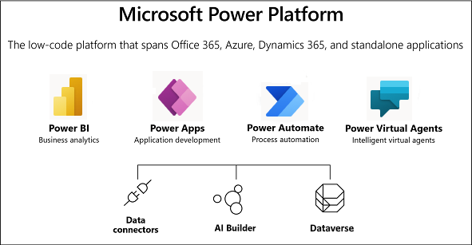
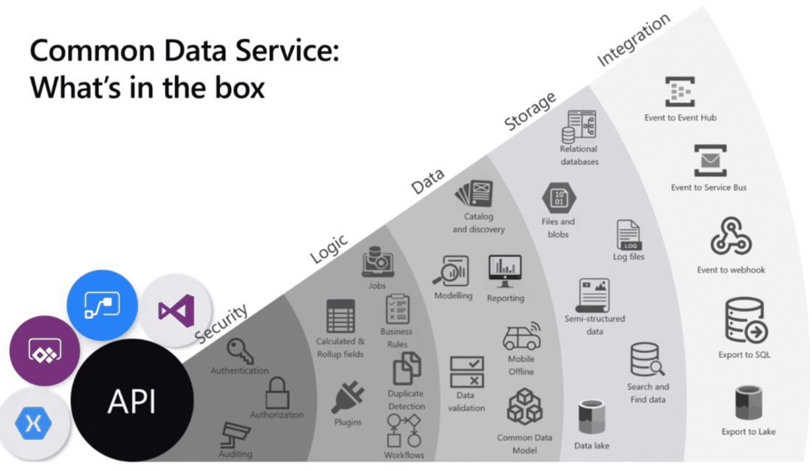

## Microsoft Power Platform

  

# Microsoft Power Platform Fundamentals

## Introduction

Power Platform was chosen due to it's relevant to my current that includes SharePoint, Dynamics 365 and Power BI. 

## Prerequisite

A Micosoft account.

## Use Case

Automate Business processes.
Power Automate can be used to automate administrative tasks using workflows and connect to Power Apps in the Power Platform. 

## Day's Study

Completed two modules:
1. Introduction to Power Platform
2. Introduction to Dataverse

  

## ☁️ Cloud Outcome

1. Learnt the components and features of the Power Platform, identify each component application to create business solutions and its value. 

2. Learnt about the basics of Dataverse and explore ways you can connect and customize data connections to Power Platform applications.

## Next Steps

Introduction to Power Apps

## Proof

1800 XP
