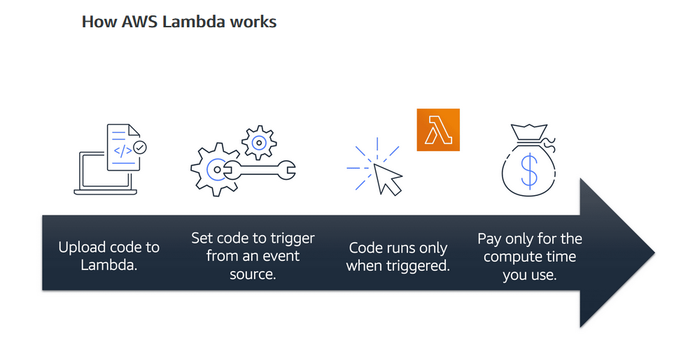

## AWS Cloud Practitioner - COMPUTE IN THE CLOUD

I finished Module 2 of AWS Cloud Practitioner a few weeks ago... I must be more disciplined with my log!

## Prerequisite

A background in IT helps, but not essential for AWS Cloud Practitioner.

## Cloud progress

Module 2: Compute in the Cloud:

1. EC2 Instance Types
2. Amazon EC2 Pricing
3. EC2 Scaling 
4. Directing traffic with Elastic Load Balancing
5. Messaging and Queueing with AWS Simple Notification Service (SNS) & Simple Queueing Service (SQS)
6. Additional compute services - Serverless computing:
    AWS Lambda
    Amazon Elastic Container Service (ECS) 
    Amazon Elastic Kubernetes Service (EKS)
    AWS Fargate - compute engine that manages serverless infrastructure

  

## Use Case

EC2 can be used for hosting services, such as websites or private server for games while load balancing can manage demand. 

Hosting multiple services with high traffic can be challenging, but managing as microservice can provide resiliance and AWS SNS & SQS will ensure that requests for services still flow even if a service or application is down.

Containers such as Docker and Kubenetes facilitates running and scaling applications on AWS, although you don't specifically need AWS to do that but it's nice when using AWS compute services in your application.
