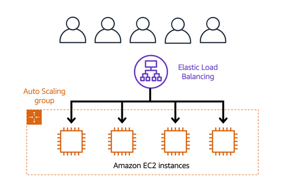

# AWS Cloud Practitioner: Module 2 - COMPUTE IN THE CLOUD

I finished Module 2 of AWS Cloud Practitioner a few weeks ago... I must be more disciplined with my log!

## Prerequisite

A background in IT helps, but not essential for AWS Cloud Practitioner.

# AWS Cloud Computing

Module 2: Compute in the Cloud, includes:

1. EC2 Instance Types
2. Amazon EC2 Pricing
3. EC2 Auto Scaling 
4. Directing traffic with Elastic Load Balancing
5. Messaging and Queueing with AWS Simple Notification Service (SNS) & Simple Queueing Service (SQS)
6. Additional compute services - Serverless computing:
    AWS Lambda,
    Amazon Elastic Container Service (ECS),
    Amazon Elastic Kubernetes Service (EKS),
    AWS Fargate - compute engine that manages serverless infrastructure.

## EC2 Types

AWS Elastic Cloud Compute (EC2) are cloud server instances of various types. Instances are configured to suit different workloads that vary in CPU, memory, storage and networking capacity.

### **Instance Types**
- General Purpose (balanced): Host different types of servers
- Compute Optimised (more CPU): Servers for web, applications and gaming
- Memory Optimised (more RAM): Servers to process large datasets and data processing
- Accelerated Computing (more GPU with hardware accelerators): For graphics processing servers
- Storage Optimised; for file systems and data warehousing that requires high sequential read & write

## Load Balancing 

Elastic Load Balancing is the AWS service that automatically distributes traffic across multiple server (EC2) instances. 

  

Messaging and Queueing is used to manage the traffic with AWS Simple Notification Service (SNS) & Simple Queueing Service (SQS) and distribute across Amazon EC2 instances, ensuring that requests are processed even if servers/resources are down.

## Serverless Computing Services

Servers require manual configuration to get them provisioned and used. It can be resource intensive to manage multiple instances. 

Serverless Computing enables you to run servers with code instead of manual configuration and implement logic to automate tasks. 

AWS Lambda is a serverless computing service in AWS. 

  

## Containers

Containers provide you with a standard way to package your application's code and dependencies into a single object. You can also use containers for processes and workflows in which there are essential requirements for security, reliability, and scalability.

You can run containers in AWS using:
1. Amazon Elastic Container Service (ECS)
2. Amazon Elastic Kubernetes Service (EKS)
3. AWS Fargate is a serverless engine for containers that manages server infrastructure

## SUMMARY

EC2 can be used for hosting services, such as websites or private server for games while load balancing can manage demand. 

Hosting multiple services with high traffic can be challenging, but managing them as microservices can provide resiliance and AWS SNS & SQS will ensure that requests for services still flow even if a service or application is down.

Containers such as Docker and Kubernetes facilitates running and scaling applications on AWS, although you don't specifically need AWS to do that but it's nice when using AWS compute services.
