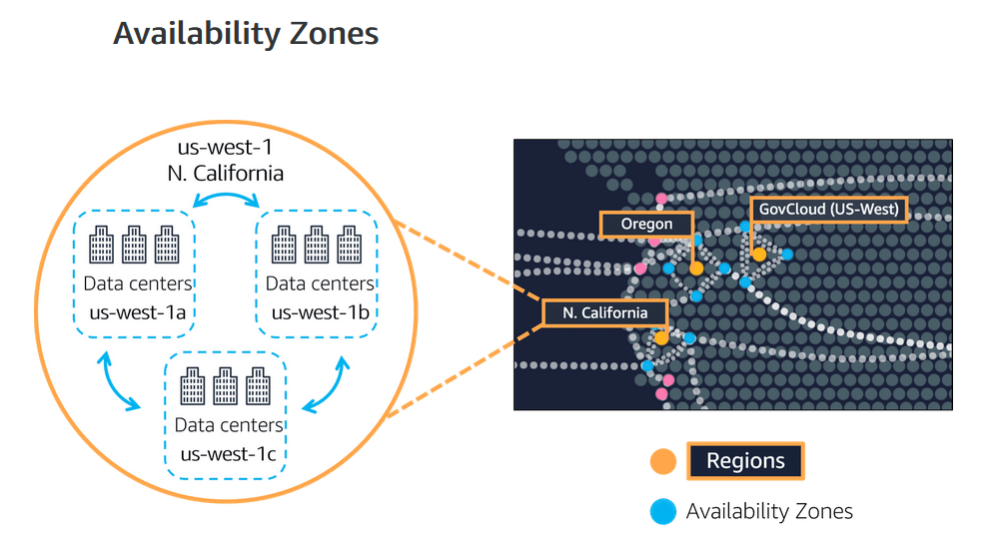

## AWS Cloud Practitioner:Module 3 - Global Infrastructure and Reliability

Module 3 explained the AWS Global Infrastructure with geographical regions which include multiple avilability zones that can provide network redudancy and service reliability. Each Region meets national data governance requirements/legislation.

  

Edge locations can be set up in any reqion to cache an instance closer to customers, thus providing lower latency and service quality.  Useful for services with multinational customers. For example, a company in Brazil with a large customer base in China could spin up an Edge location in China - see image below:

  <image src="edge-locations">

## ☁️ How to Provision Resource

AWS Infrastructure can be provisioned via multiple tools:

1. AWS Console - Set up infrastrucuure using the GUI
2. AWS CLI - set up via commands
3. Software Development Kits - for developers

Managing Infrastrucure via code aka 'infrastrucutre as code' provides much higher efficiency to infrastructure management via command line scripts and configuration settings for auto scaling and load balancing. AWS have a couple of tools for that:

4. AWS Elastic Beanstalk 
5. AWS Cloud Formation 

## End of module 3.