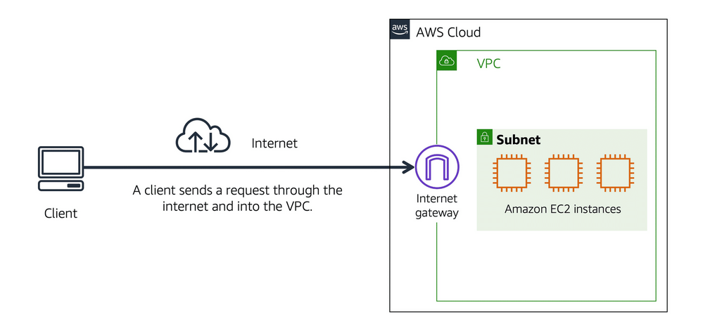

# AWS Cloud Practitioner:Module 4 - Networking
AWS networking was completed after a mid-module hiatus building a new PC, but I'm back on my journey to the cloud.

The AWS networking module explains the basics of networking; networks and sub-networks (subnets), within AWS Virtual Private Cloud (VPC) that can be Public or Private (by default). Module explaines how to connect to a VPC and use other resources. 

## ☁️ Public Cloud
Public cloud (network) requires an Internet gateway to allow Internet traffic to reach resources in the VPC, for an example an EC2 resource.

  

## ☁️ Private Cloud
A Private cloud (network) requires a VPN connection to a Virtual Private Gateway to allow private approved network access to resources or information. AWS Direct Connect is a media between an On Prem data centre environment and the cloud. 

  <image src="AWS-VPC-DirectConnect.png">

## Subnets and Access Control Lists - Security
Network addresses are divided into sub-networks to segregate resources based on operational requirements and security.

Network Access Control Lists (ACLs) is a virtual firewall that filters packets i.e. the inbound and outbound traffic for each subnet, for example:
- Allow all inbound & outbound traffic (default ACL setting)
- Allow all inbound, deny outbound
- Deny all inbound & outbound

  <image src="AWS-cloud-subnets.png">

### Stateless packet filtering
Network ACLs check all inbound and outbound packets, meaning they are Stateless -- 'remember nothing, check everything'.

### Stateful packet filtering - Security Groups
Security groups is an important function in AWS. A security group is a virtual firewall that controls inbound and outbound traffic, for an example in an EC2 instance. Security groups can be assigned to multiple instances, making security management easier. 

If you don't assign a security group for a VPC, it defaults to 'Allow all outbound, Deny all inbound'.

  <image src="AWS-VPC-security-groups.png">

## Global Networking - DNS
The concluding section for this Networking module is the **Domain Name System (DNS)**. DNS is a directory of Internet IP addresses and corresponding web address, used to route traffic on the Internet. 

### Amazon Route 53 - DNS web service
Amazon Route 53 is the AWS DNS Service that allows Internet users to connect to AWS resources, e.g. a EC2 instance. You can also register Domain Names and manage existing domains by transferring domains from other registrars to manage everything from a single source. 

Amazon Route 53 can coexist with Amazon Cloudfront (a Content Delivery Network (CDN)) at Network Edge Locations to provide a low latency, fast & secure delivery of service to customers. Amazon Cloudfront integrates with all required AWS resources and services.

  <image src="AWS-VPC-Route53-Cloudfront.png">

# End of module 4 - Networking.
